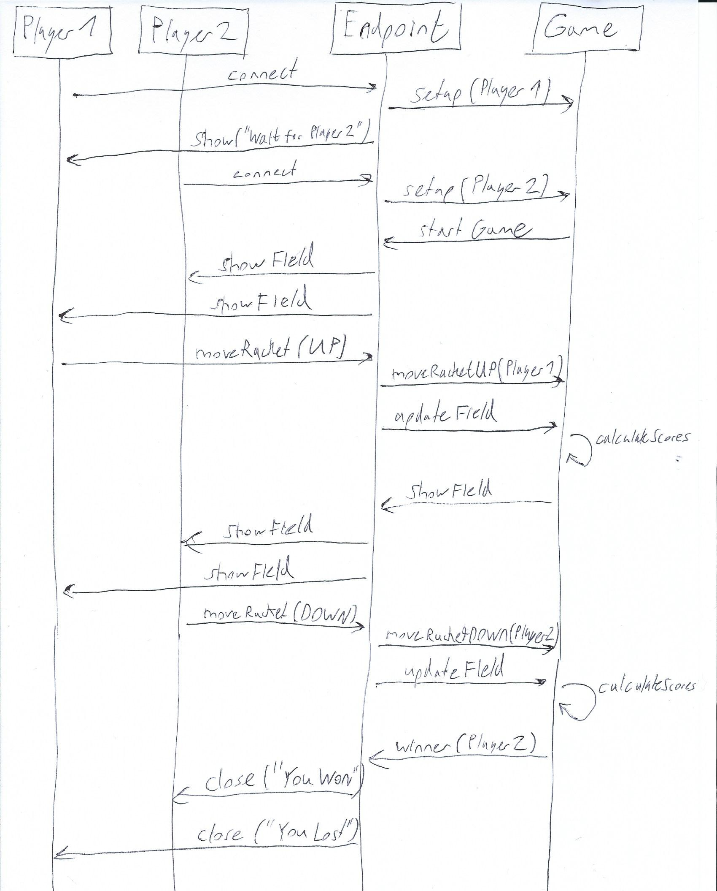
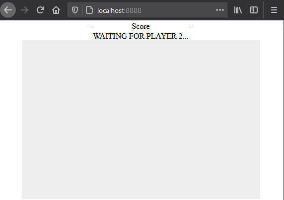
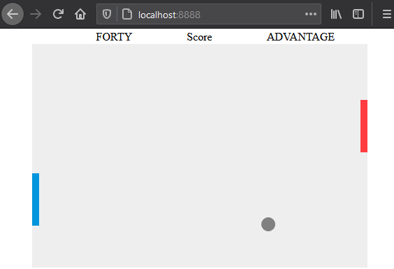
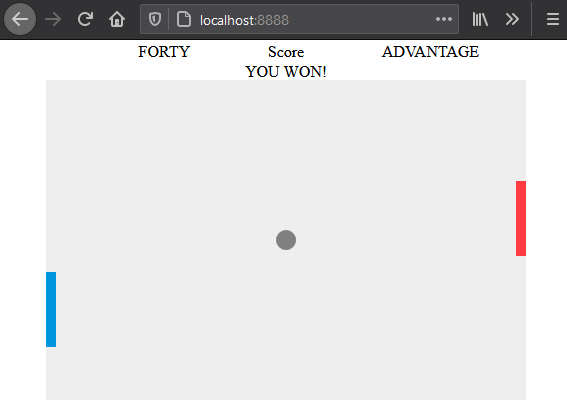
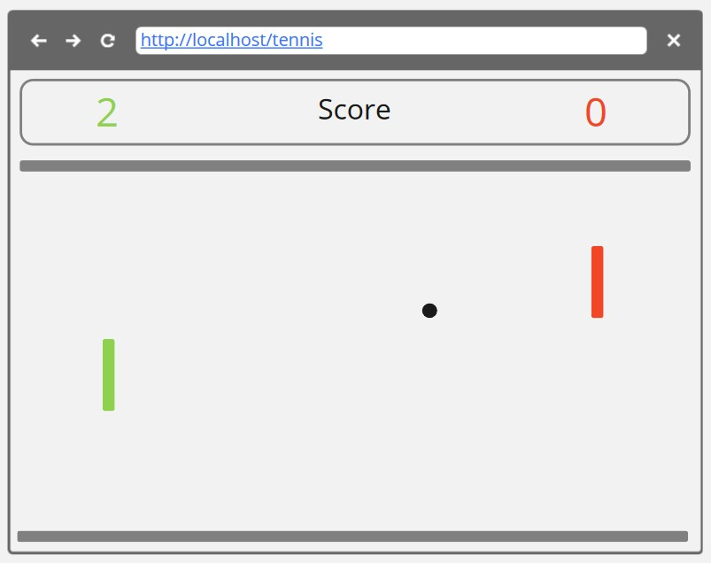

# Tennis Game
Im Rahmen des Foundation Level Zertifikats der CSS Software Academy wurde eine selbst gewählte Programmieraufgabe 
umgesetzt.
Bei der Aufgabe handelt es sich um ein Tennis Game, welches folgende Coding Kata als Vorlage nimmt:
https://codingdojo.org/kata/Tennis/

## Features
- Browser Applikation (unterstützte Browser: Firefox)
- Berechnung des Balles in Echtzeit
- Vertikale Steuerung des Rackets (Spielfigur) via Pfeiltasten
- Anzeigen von eigenem und gegnerischem Racket in Echtzeit
- 2 Spieler Multiplayer
- Lobbyfunktion in welcher 2 Spieler joinen können

## Spielregeln
- Jeder Spieler kann folgender Score haben: **0, 15, 30, 40**
- Der Spieler, welcher nach dem **Score** 40 ein Punkt macht, gewinnt
- Wenn beide Spieler den Score 40 erreichen, wechselt das Spiel in den Status **Deuce**
  - Im Status Deuce, erreicht der Gewinner des Balls den Score **40A** und hat **Matchball**
  - Gewinnt der Spieler mit Score 40A, gewinnt er das Spiel
  - Gewinnt der Gegenspieler (mit Score 40), wechselt das Spiel wieder in Status **Deuce**

## Steuerung
- Pfeiltaste ↑: Racket nach oben verschieben
- Pfeiltaste ↓: Racket nach unten verschieben

## Technologien
- Java SDK 15.0.1
- Helidon 2.0.2 (Webserver/Websockets)
- JavaScript/CSS/HTML (Frontend)

## Message Data Flow

## Aktueller Stand

### Mit TDD entwickelte Klassen
Alle Klassen in folgendem Package wurde mithilfe von TDD entwickelt:
`ch.css.coaching.game.score`

### Offene Features
- Automatisches Wiederverbinden nach Verbindungsunterbruch
- Erweiterung von Scoring mit Spielen/Sätzen
- Variation des Schwierigkeitsgrades (dynamische Beschleunigung des Balles) 
- Vergrösserung des Spielfelds
- Responsive GUI (Handy/Tablet)

### Github
https://github.com/Degeloper/tennis

## Screenshots
### Warten auf Spieler 2

### Spielen nach Eintritt von Spieler 2

### Bildschirm von Gewinner (Spieler 2)

### Bildschirm von Verlierer (Spieler 1) 

## Mockup für Design

