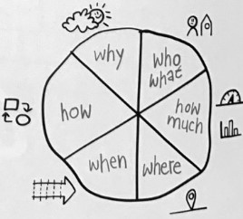

# Tennis Game

Für die das Zertifikat Foundation Level der CSS Software Academy soll eine Beispielapplikation erstellt werden.
Es soll ein Tennis Game erstellt werden mit folgender Coding Kata als Vorlage: 
https://codingdojo.org/kata/Tennis/

## Anforderungen
- Browserapplikation
- Berechnung des Balles in Echtzeit
- Steuern des "Tennisschlägers" via Maus/Pfeiltasten
- 2 Spieler Multiplayer
- Lobbyfunktion in welcher 2 Spieler joinen können

## Regeln
- Jeder Spieler kann folgender Score haben: **0, 15, 30, 40**
- Der Spieler, welcher nach dem **Score** 40 ein Punkt macht, gewinnt
- Wenn beide Spieler den Score 40 erreichen, wechselt das Spiel in den Status **Deuce**
  - Im Status Deuce, erreicht der Gewinner des Balls den Score **40A** und hat **Matchball**
  - Gewinnt der Spieler mit Score 40A, gewinnt er das Spiel
  - Gewinnt der Gegenspieler (mit Score 40), wechselt das Spiel wieder in Status **Deuce**

# Visual Problem Solving

## Wer
2 Spieler mit unterschiedlichen Farben:
some *blue* text.
Green :-)
	
Red (-: 

## Wo
- Spieler in Browser
- Jeder Spieler sieht sich selbst als Player 1 (Grüner Balken links)

## 

### Mockup

