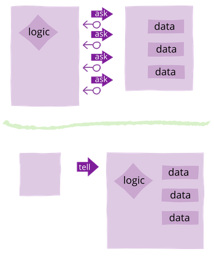
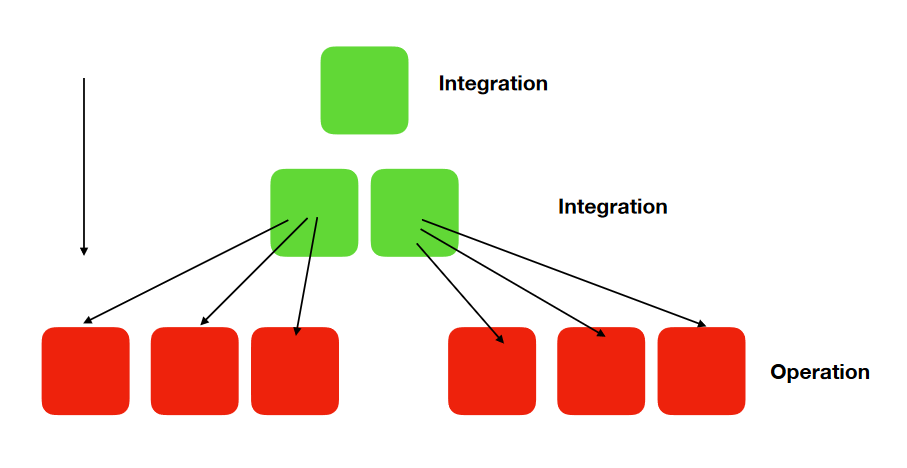
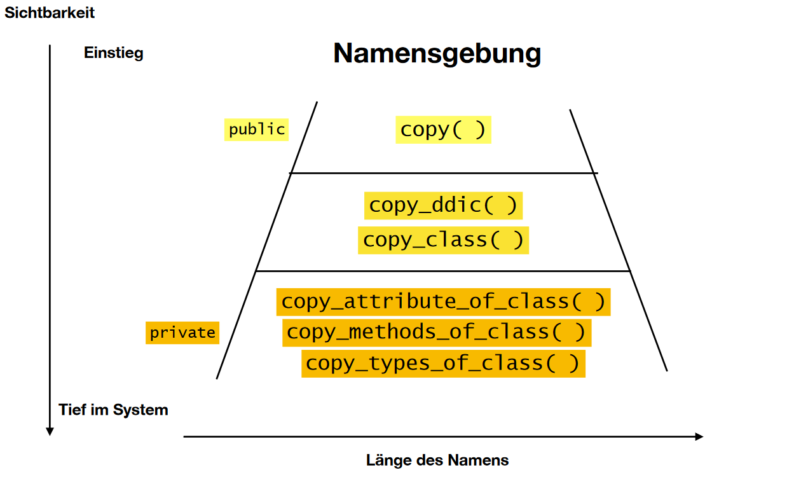

# Clean Object Calesthenics

# 5 Prinzipien

- Messaging
- Living Objects
- 4 Rules of Simple Design
- IOSP
- Software Dimension

## Messaging

In der OO-Programmierung ging es dem Erfinder Alan Kay primär nicht darum,
die Welt möglichst realitätsnahe in Klassen zu unterteilen.
Viel wichtiger ist das Augenmerk darauf zu richten, wie Objekte miteinander interagieren (Messaging) und welche Daten sie
benötigen (Data-Flow) um Ihre Aufgabe erledigen zu können ([Alan Kays Definition Of Object Oriented][1])

In der OO-Entwicklung neigt man dazu, zwar die Domäne sauber in Klassen abzubilden, 
diese dann aber dumme Datenhüllen sind. Sie enthalten kein Verhalten (behaviour) und tragen die innere Struktur der 
Klasse nach Aussen, indem sie diese mit Getter Methoden beleuchten (siehe auch "Living Objects").

Ein hilfreiches Konzept um solche Klassen zu vermeiden ist [Tell don't ask (Martin Fowler)][2].

Die öffentlichen Methoden einer Klasse sollen anderen Objekten aufzeigen, wie damit interagiert werden kann (API).
Wenn z.B. Objekt A eine Methode von Objekt B aufruft, schickt er ihm eine Nachricht (Message). 
Die Nachricht soll dem Empfänger möglichst konkret sagen, was zu tun ist (tell!). 
Die Daten, die an den Aufrufer zurückgeschickt werden, sollen ihn nicht zum Nachfragen animieren (don't ask!).



Quelle: https://martinfowler.com/bliki/TellDontAsk.html


## Living Objects

Wie bereits bei Messaging angesprochen ist es schlechtes objektorientiertes Design (OOD), wenn die Objekte 
kein Verhalten haben. Das Prinzip Living Objects bemüht sich darum, den Klassen
mehr leben einzuhauchen und den Sprung von strukturierter hin zu objektorientierter Entwicklung zu machen.
Es gibt Parallelen zum "Messaging" Prinzip aber was bringt gutes Messaging, wenn 
alle Klassenvariablen und Methoden statisch sind?

Statische Methoden sind OOD Killer und können für OO-Neulinge verlockend wirken.
Statische Methoden verunmöglichen aber den Einsatz von Instanzvariablen.
Damit ein Objekt ein Verhalten haben kann, braucht es aber Daten um seinen Zustand speichern zu können.
Diese Daten sollen intern in Form von Instanzvariablen gespeichert werden. 
Dadurch entsteht eine interne Struktur, welche es gegen Aussen so gut wie möglich zu verbergen gilt (Information Hiding). 
Die bereits erwähnten Getter-Methoden machen dabei das pure Gegenteil. Sie verhindern zwar den direkten Zugriff der Daten, 
jedoch geht es bei Information Hiding weniger um das Verstecken von Daten als vielmehr um das Verstecken von 
Design Entscheide (Strukturen) innerhalb einer Klasse ([Protected Variation, Craig Larman][3]).

## 4 Rules of Simple Design
Das Design einer Software wird dann als simpel verstanden, wenn der Source-Code alle folgende 4 Regeln einhält:

1. passes its tests
2. minimises duplication
3. reveals its intent
4. has fewer classes/modules/packages

Vor allem der 2. und 3. Regel sollte besondere Beachtung geschenkt werden. 
In der Theorie führt die Erfüllung der Disziplinen "minimize duplication" und "reveal its intent" automatisch
zu minimierter Anzahl von Klassen/Modulen/Packages. 

Methoden wie Test Driven Design (TDD) führen dazu, dass automatisch grüne Unit Test entstehen. 
Die Unit Tests können auch als Beweis dafür verstanden werden, dass der Code einfach testbar und somit auch
simpel designt ist.

Einer der schwersten (wenn nicht die schwerste) Disziplin im Alltag eines Entwicklers ist die adäquate Vergabe von Namen.
Vor allem für die Einhaltung der 3. Regel verbirgt sich darin die grösste Herausforderung. Oft fällt es einem schwer, 
Dinge wie Klassen, Methoden oder Variablen sinnvoll zu benennen. 
Und oftmals liegt das Problem ganz einfach darin, dass das zu benennende Ding mehrere Verantwortlichkeiten besitzt (SRP).
Im Laufe des Refactoring-Prozesses wird eine Methode/Klasse/Variable mehrfach umbenannt und kann dann folgende Stadien
durchlaufen:   

1. nonsense
2. accurate-but-vague
3. precise
4. meaningful/intention-revealing

Für Stadium 1 wird ein Platzhalter wie `foo()` verwendet. Dieser dient lediglich zur erfolgreichen Kompilierung.
In Stadium 4 ist die optimale Abstraction erreicht. Die Intention der Variable/Methode/Klasse ist mithilfe des Namens
selbsterklärend. 
Wichtig ist auch die Beachtung der Länge bei der Namensgebung (siehe auch "Software Aesthetics"). 

## IOSP
Das Integration Operation Segregation Principle (IOSP) wurde von Ralf Westphal erfunden.
Das Prinzip separiert Code in einzelne Units und kategorisiert diese:

- Operational Units
  - Enthält Business Logic
  - Ist idempotent
  - Darf keine Integration Units aufrufen  
  - Bekommt die Daten Injected
  - Ist immer der Leaf Node
- Integration Units
  - Enthält Daten
  - Gibt die Daten an Operational Units weiter  
  - Kann andere Integration Units aufrufen

Das primäre Ziel ist dabei die Testbarkeit und Lesbarkeit zu erhöhen.
IOSP geht Hand in Hand mit TDD.

Durch die Einhaltung der obigen Regeln entsteht eine Baumstruktur:

### IOSP Baumstruktur


### Beispiel
```
public void scoreBall(Player scoringPlayer) {              //Methode von Integration Unit    
    Player opponent = opponentOf(scoringPlayer);           //Operationsmethode für Selektion
    if (scoringPlayer.hasMatchball(opponent.getScore()))   //Operationsmethode mit Injection von Daten
      winner = scoringPlayer;                              //Datenhaltung innerhalb der Integration Unit
    ...
}
```

## Software Dimension

Dimensionen von Software können horizontal und vertikal gemessen werden.

### Horizontale Metrik
Die maximale Einrückungstiefe ist eine einfache aber effektive Metrik wie die horizontale Komplexität 
ermittelt werden kann ([Your Code as a Crime Scene, Adam Tornhill][4]).
Die Einrückungstiefe hat einen direkten Einfluss auf die Symmetrie der Software (siehe "Software Aesthetics").

### Vertikale Metrik
Eine hohe vertikale Komplexität von Source Code bedeutet zu viele Anzahl Zeilen in einer Klasse.
Dies kann auf einen Verstoss gegen das Single Responsibility Pattern (SRP) hindeuten.

# Design-Mindset

## Software Aesthetics

Software Aesthetics beschäftigt sich mit der allgemeinen Symmetrie von Source Code.
Es geht darum sich Fragen zu stellen wie:

- Ist Anzahl der Tests ausgleichend zur Anzahl der produktiven Methoden?
- Ist das Verhältnis von vertikale mit der horizontalen Dimension im Gleichgewicht? 
- Ist die Größe der vorhandenen Klassen ähnlich?
- Wann muss ich dieses Design etwas aufweichen (Asymmetrie) um ein besseres Ergebnis zu erreichen?
- Verhältnis von Imports zu Anzahl Zeilen
- Verhältnis von externen zu internen Dependencies

### Namensgebung
Ein wichtiger Aspekt in der Symmetrie ist Länge von Methodennamen.
Generell gilt für die Namensgebung: 
Je grösser der Scope (Sichtbarkeit) einer Methode/Klasse/Variable, desto kürzer sollte der Name sein: 


 
### Beispiel
```

public void run() {                                                       //Grosser Scope (public): Name kurz und prägnant
    if (scorer.winner().isPresent())
      electWinnerAndResetGame(scorer.winner().get());

    Optional<Racket> missedRacket = field.racketThatMissedTheBall();
    if (missedRacket.isPresent())
      givePointToOpponentAndResetBall(missedRacket.get().getPlayer());    //Kleiner Scope (private): Name lang und detailliert
    else
      field.moveBall();
            
    updateFields();
}
```

Durch die Einhaltung der Namensgebungsregel bekommt der obere Code-Block die Form eines `>`, was nicht unüblich und 
generell als ästetisch und gut lesbar wahrgenommen wird.

Eine einfache und schnelle Methode den Source Code auf Lesbarkeit zu prüfen ist der "Squint Test":
Durch das Zusammenkneifen der Augen wird die Struktur des eigenen Source Code objektiv wahrnehmbar.
Ungewohnte Formen können dann auf zu tief verschachtelte `if` Statements und häufige Farbwechsel
auf zu komplexen Abstraktionen hindeuten (gute IDE vorausgesetzt).

[1]: https://wiki.c2.com/?AlanKaysDefinitionOfObjectOriented
[2]: https://martinfowler.com/bliki/TellDontAsk.html
[3]: https://martinfowler.com/ieeeSoftware/protectedVariation.pdf
[4]: https://www.simpleorientedarchitecture.com/book-review-your-code-as-a-crime-scene/
